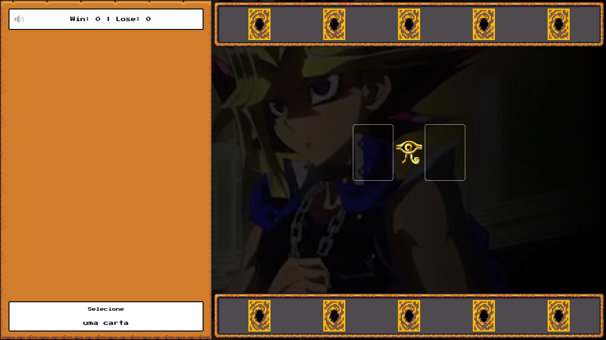
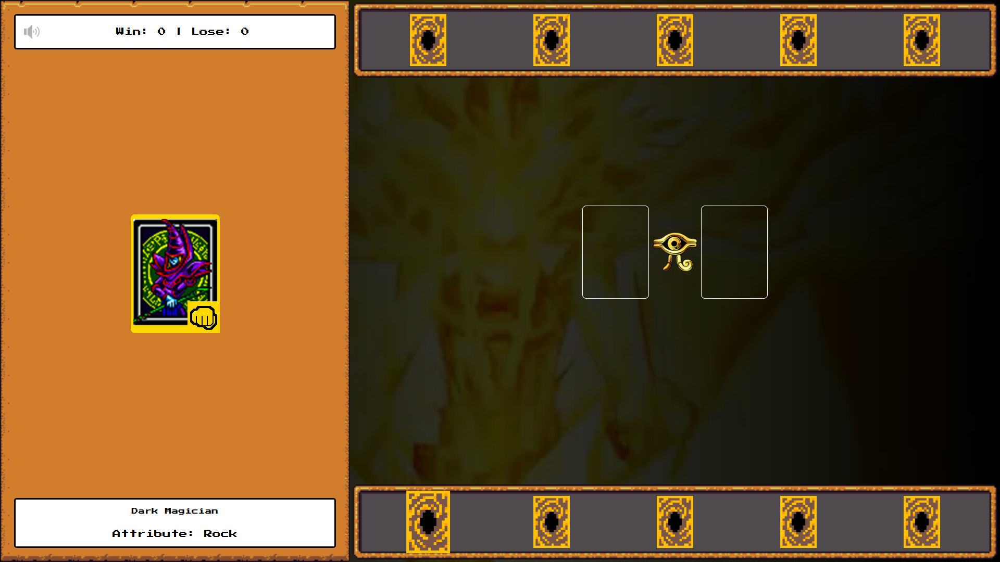
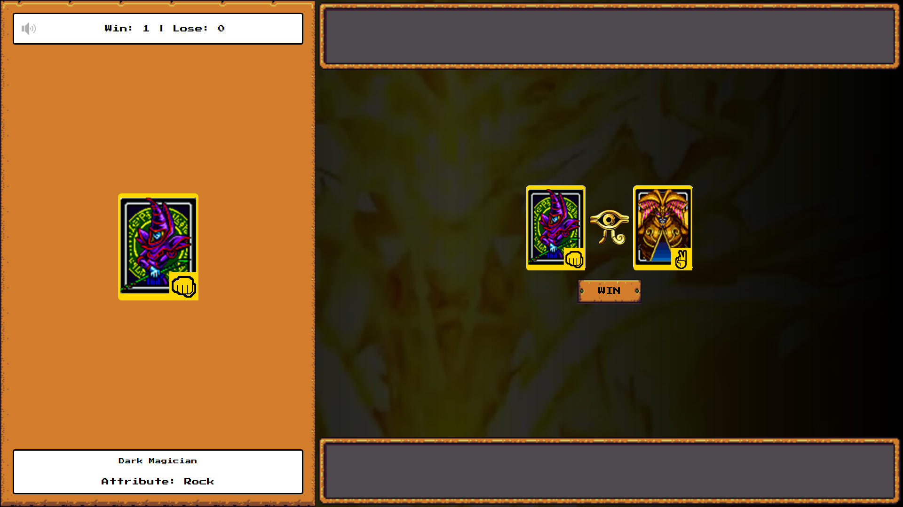

🎴 Yu-Gi-Oh! Jokenpô Edition

    Desafio DIO - Criando um Jogo de Cartas do Yu-Gi-Oh! com JavaScript e CSS

📋 Índice

    📖 Sobre
    🚀 Tecnologias Utilizadas
    🖥 Preview
    📌 Créditos

📖 Sobre

Este projeto foi desenvolvido como parte do Bootcamp Ri Happyy - Front-end do Zero na DIO. O jogo é uma adaptação do clássico Jokenpô (Pedra, Papel e Tesoura) utilizando personagens icônicos do universo Yu-Gi-Oh!.
🕹️ Como Jogar:

O jogador escolhe uma carta e o computador faz sua escolha automaticamente. O resultado da partida é decidido conforme as regras do Jokenpô, adaptadas para os personagens do jogo:

    Dark Magician representa Pedra
    Blue Eyes White Dragon representa Papel
    Exodia representa Tesoura

Lembre-se das interações:

    Pedra vence Tesoura
    Tesoura vence Papel
    Papel vence Pedra

🃏 Cartas Disponíveis:

 
 <h4 style="text-align: center">Dark Magician | Pedra</h4>  
 
 <h4 style="text-align: center">Blue Eyes White Dragon | Papel</h4>  
 
 <h4 style="text-align: center">Exodia | Tesoura</h4>  
 

🚀 Tecnologias Utilizadas

As principais tecnologias utilizadas no desenvolvimento deste projeto foram:

HTML5 CSS3 JavaScript
🖥 Preview

    

📌 Créditos

Desenvolvido por Gilmar Shuenck durante o Bootcamp Ri Happyy - Front-end do Zero da DIO.